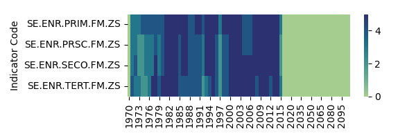
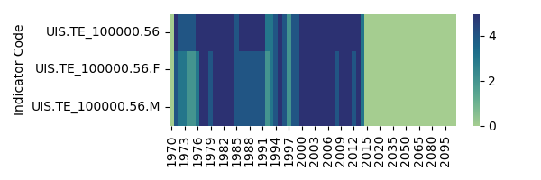

# Project of Data Visualization (COM-480)

| Student's name | SCIPER |
| -------------- | ------ |
| Francisco Morales| 353614|
| Julien Ars | 314545 |
| Blanche Duron | 282248 |

[Milestone 1](#milestone-1) • [Milestone 2](#milestone-2) • [Milestone 3](#milestone-3)

## Milestone 1 (29th March, 5pm)

### Dataset
The main dataset for this project is the **World Bank's EdStats**: [Education Statistics](https://datacatalog.worldbank.org/search/dataset/0038480/education-statistics). It encompasses education-related metrics such as enrollment rates, literacy rates, educational expenditure, and teacher-student ratios across countries worldwide since 1970.

We might also draw from **national education databases**, which can offer detailed insights into various facets of each country's education system, including curriculum standards, teacher qualifications, school facilities, and student performance.

Additionally, we plan to incorporate a few selected visuals from **school websites** and **Google Maps** to enhance our visualization, offering a more immersive experience and showcasing the real-world context of educational institutions.

### Problematic

> Exploring global education through interactive visuals to uncover the diversity and disparities within school systems across various landscapes.

Our visualization project aims to examine the diversity of schools in selected countries, including the USA, Mexico, Japan, India, and Switzerland. We will focus on comparing data between different areas, such as urban versus rural settings, or based on economic indicators. By analyzing a range of educational indicators and attributes, our goal is to illuminate the disparities and similarities in school systems across diverse geographic contexts. Motivated by a desire to showcase both the diversity and inequalities within education systems, our visualization will invite viewers to explore and reflect on the complex landscape of schooling worldwide.

### Exploratory Data Analysis

The World Bank proposes a very powerfull [database exploration tool](https://data.worldbank.org/topic/education?year=2021) to explore the dataset. Initial exploration can therefore be done directly online. As seen in the images below, we already notice disparities in the data availlable between the countries, with sometimes big gaps in the data availlable :

The dataset is massive, and countains a lot of indicators.However, upon opening of it, we noticed a lot of missing values. We noticed many indicators had low number of values. As such, we started to look for indicators with sufficient data points (process and code in file `milestone1.ipynb`).

Preliminarily, we defined "sufficient data points" as having at least 18 years availlable for the 5 selected countries (USA, Mexico, Japan, India, and Switzerland). This brought the number of indicators down to 760. Then, we noticed many indicators could be grouped (i.e. population by age and genre were different indicators but could be considered together). As such, we reduced those indicators to 30 "groups".

For the purpose of exploratory analysis, we selected 3 of those groups and explored their statistics :
- SE.ENR : Gender parity index in Gross enrolment raito
- SE.SCH : School life expectancy
- UIS.TE_100000 : Enrolment in tertiary education per 100'000 people

#### (SE.ENR) Gender parity index

There are 4 indicators in this group, the gender parity index for primary and secondary education, for primary education only, for secondary education only and for tertiary education.

| Indicator Code    | Indicator Name                                                          |
|:------------------|:------------------------------------------------------------------------|
| SE.ENR.PRSC.FM.ZS | Gross enrolment ratio, primary and secondary, gender parity index (GPI) |
| SE.ENR.PRIM.FM.ZS | Gross enrolment ratio, primary, gender parity index (GPI)               |
| SE.ENR.SECO.FM.ZS | Gross enrolment ratio, secondary, gender parity index (GPI)             |
| SE.ENR.TERT.FM.ZS | Gross enrolment ratio, tertiary, gender parity index (GPI)              |

As we can see in the histograms, the distribution is centered around 1 for primary education but mainly flat for tertiary education. We also notice India and the United States standing out, India having a reduced ratio while the United States has a distribution above the other countries for tertiary education.

The next graphic represents the number of countries (in the five countries selected) for which an indicator has data on a given year. As we can see, there are no data beyond 2016 and low availlability before 2000. 
.

Represented over a time scale, we notice that there are sufficient data points to give an idea of the evolution of the gender parity index in the 5 countries :

---
#### (SE.SCH) School life expectancy

In this group, we have 3 different indicators : the school life expectancy for the whole population, for males only or for females only.

| Indicator Code   | Indicator Name                                                  |
|:-----------------|:----------------------------------------------------------------|
| SE.SCH.LIFE      | School life expectancy, primary to tertiary, both sexes (years) |
| SE.SCH.LIFE.FE   | School life expectancy, primary to tertiary, female (years)     |
| SE.SCH.LIFE.MA   | School life expectancy, primary to tertiary, male (years)       |

The histograms shows values between 4 and 17, but with already disparities between countries. This will probably prove an interesting indicator, going further.

For this group, we start to have good data on all indicators starting around 1980 again, but the data really becomes complete year-on-year in the years 2000.
Again, data stops around 2015.

Indeed, we notice here clearly the disparities and the data that starts later for some countries, or has some big gaps (e.g. mexico in the indicator for females/males)

#### (UIS.TE_100000) Enrolment in tertiary education

For this group, there are 3 different indicators, again around the genres :

| Indicator Code     | Indicator Name                                                      |
|:-------------------|:--------------------------------------------------------------------|
| UIS.TE_100000.56   | Enrolment in tertiary education per 100,000 inhabitants, both sexes |
| UIS.TE_100000.56.F | Enrolment in tertiary education per 100,000 inhabitants, female     |
| UIS.TE_100000.56.M | Enrolment in tertiary education per 100,000 inhabitants, male       |

The histograms show a big differnece between India (low values), the United States (high values) and the other three countries.

Data is more complete than school life expectancy, but still has the same gaps for some countries.

Over time, data seems sufficiently complete, but we observe around 1995 a big step in Japan enrolment, which could be investigated further.

### Related work

- **What others have already done with the data?**

Many organizations, including the World Bank and UNESCO, have analyzed global education data, focusing primarily on broad statistics. These analyses often examine the number of individuals in a country who have access to education versus those who do not, providing a general overview of global education trends. There are numerous reports and summaries that describe these macro trends, highlighting overall progress and challenges in global education.

- **Why is your approach original?**

Unlike previous studies that concentrate on macro-level statistics, our project aims to delve into the nuances of educational diversity. We want to understand how educational experiences differ across regions, cultures, and socioeconomic backgrounds. By comparing aspects such as rural versus urban education or the disparities between rich and poor communities, our analysis will provide a more detailed view of the education landscape. This approach will allow us to explore the diversity of educational experiences beyond just numerical data, capturing the essence of how education varies worldwide.

- **What source of inspiration do you take? Visualizations that you found on other websites or magazines (might be unrelated to your data).**

Our project is inspired by the detailed visual storytelling found on Gapminder’s [Dollar Street](https://www.gapminder.org/dollar-street). This platform illustrates the living conditions of people at different income levels across various regions by showcasing everyday items like shoes, cutlery, and houses. Similarly, we aim to provide a detailed perspective on education around the world, moving beyond macro statistics to reveal the educational experiences across different socio-economic brackets and culture contexts.

- **In case you are using a dataset that you have already explored in another context (ML or ADA course, semester project...), you are required to share the report of that work to outline the differences with the submission for this class.**

Some of us worked on the same project for the ADA course. We did an analysis on bias in Wikipedia articles using a game called Wikispeedia. This project involved mapping links between articles and comparing the volume of content related to specific regions to highlight geographical biases. An initial step, for example, required creating a table with the population data of each country. We might use some of these macro statistics into our current analysis of global education. The project repositery can be found [here](https://github.com/epfl-ada/ada-2023-project-jellyfish401.git).

## Milestone 2 (26th April, 5pm)

**10% of the final grade**
- The project goal description can be found [here](milestone_2.md). 
- The project prototype can be accessed [here](https://bduron99.github.io/).

## Milestone 3 (31st May, 5pm)

**80% of the final grade**

## Late policy

- < 24h: 80% of the grade for the milestone
- < 48h: 70% of the grade for the milestone

