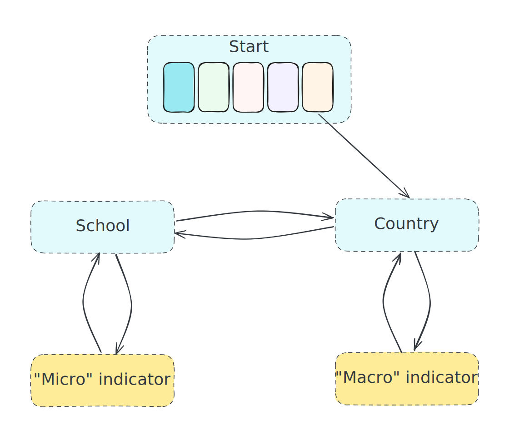
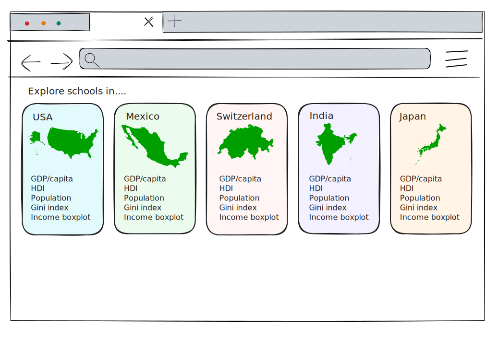
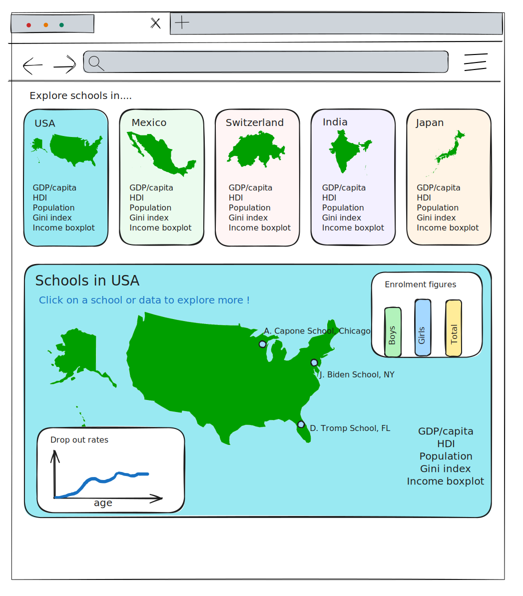
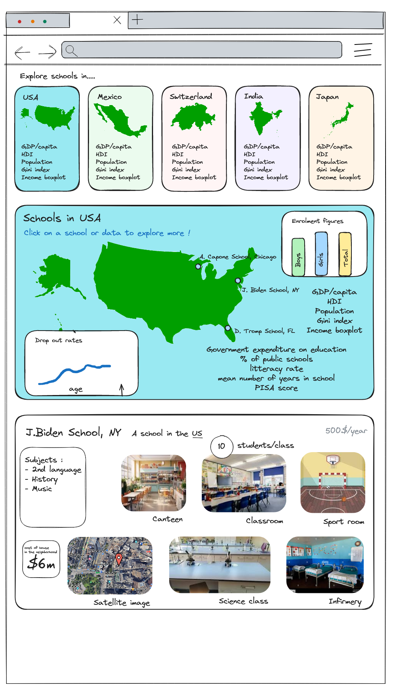
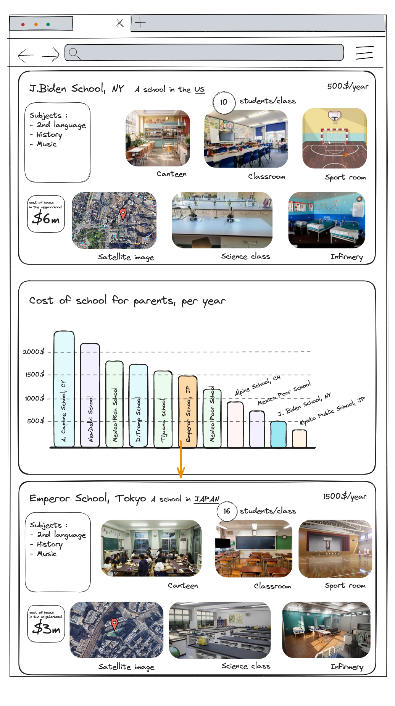
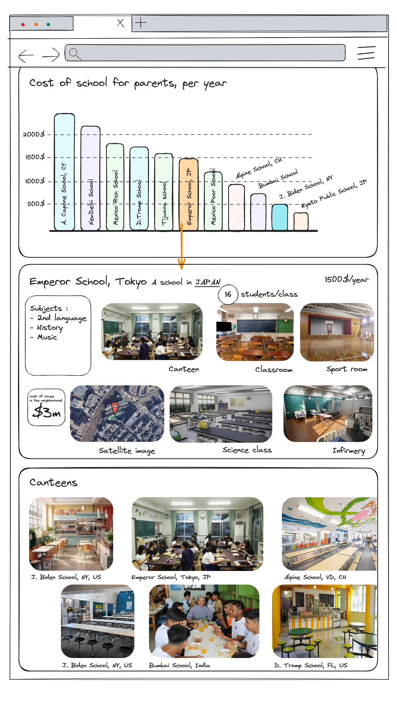

# Milestone 2

> Prototype :

> **Project goal :** 
>
> Exploring global education through interactive visuals to uncover the diversity and disparities within school systems across various landscapes.

## Objectives of the visualisation

In order to highlight the disparities between different schools, we wanted a visualisation allowing the user to :
1. Explore many indicators, on different scales,highlighting either the differences or some possible causes of those differences between schools or school systems.
2. Discover quickly disparities within the world or within a same country
3. Discover links between indicators and/or school conditions

## The visualisation

The project will allow users to create their own infinite story, navigating between school systems (i.e. countries) or individual schools (+/- 3 per countries) by selecting indicators (either "macro", so by country, or "micro", so by school). The previous steps in the story will be kept, allowing the user to visualise its whole travel.

On opening, the website will display 5 countries, their map and some generic information about the countries:

Once the user has selected a country, it displays a card with more information about the selected country, and on the map of the country, the different schools for which we have information:

The user can then either select an indicator (for example the enrolment figures) and compare the results for this indicator between the countries, or click on a school  and see the profile of this school:

From this, the user could for example click on a numeric value to compare this "micro" indicator with the corresponding values for other schools, then click on the value of a school to see the page of a new school:

The user can also click on an image of a facility to compare the facilities of different schools :
