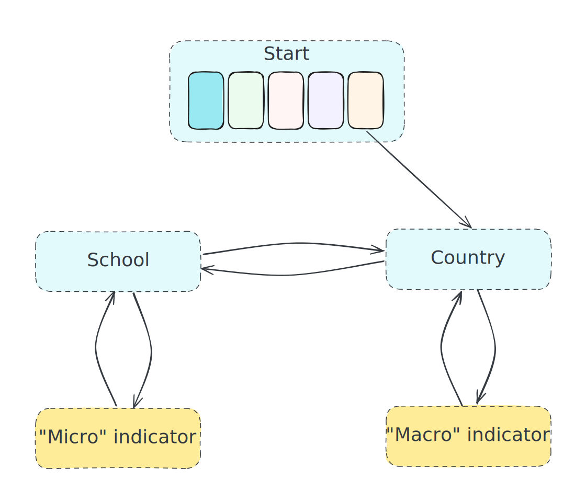
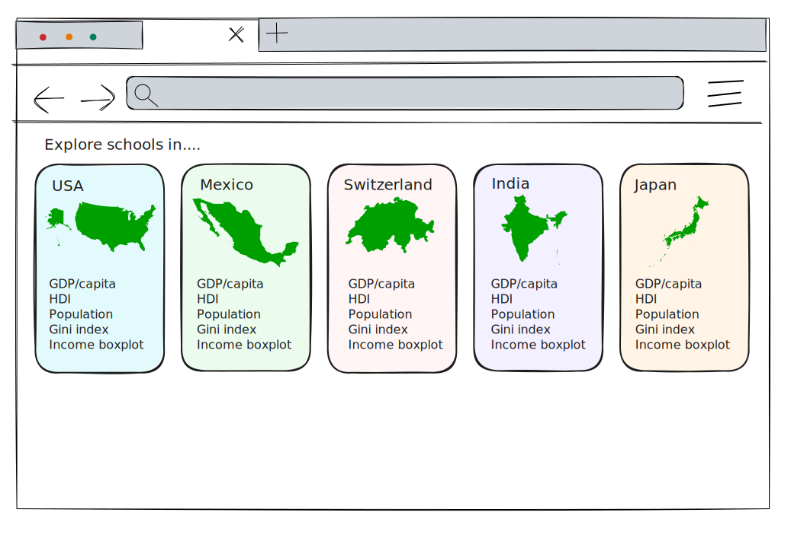
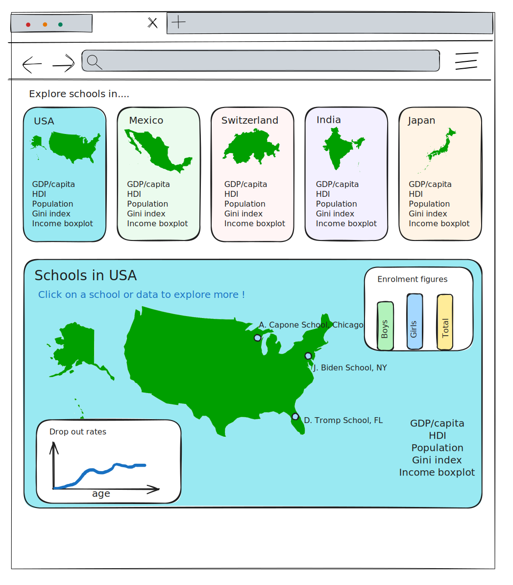
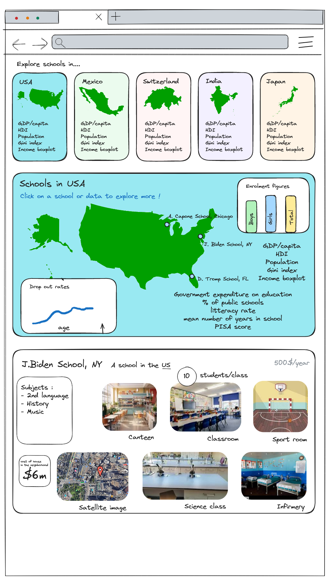
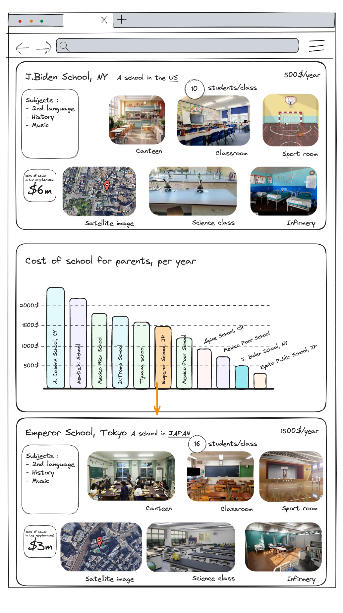
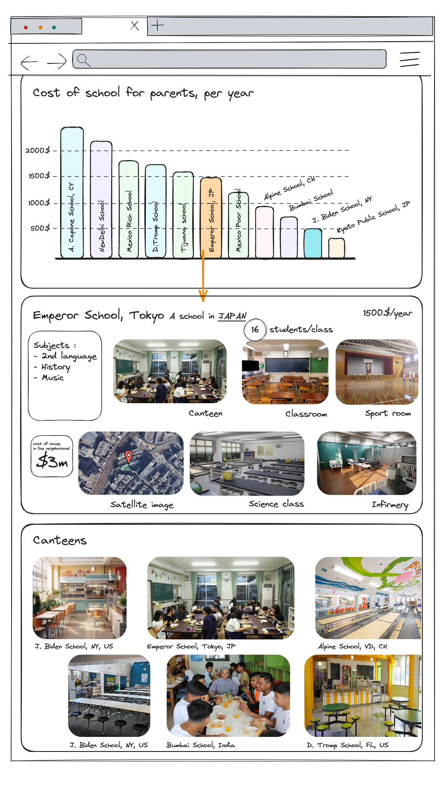

# Milestone 2

| Student's name    | SCIPER |
| ----------------- | ------ |
| Francisco Morales | 353614 |
| Julien Ars        | 314545 |
| Blanche Duron     | 282248 |

> Prototype : [Link](https://bduron99.github.io/)

> **Project goal :** 
> 
> Exploring global education through interactive visuals to uncover the diversity and disparities within school systems across various landscapes.

## Objectives of the visualisation

In order to highlight the disparities between different schools, we wanted a visualisation allowing the user to :

1. Explore many indicators, on different scales,highlighting either the differences or some possible causes of those differences between schools or school systems.
2. Discover quickly disparities within the world or within a same country
3. Discover links between indicators and/or school conditions

## The visualisation

The project will allow users to create their own infinite story, navigating between school systems (i.e. countries) or individual schools (+/- 3 per countries) by selecting indicators (either "macro", so by country, or "micro", so by school). The previous steps in the story will be kept, allowing the user to visualise its whole travel.

On opening, the website will display 5 countries, their map and some generic information about the countries:

Once the user has selected a country, it displays a card with more information about the selected country, and on the map of the country, the different schools for which we have information:

The user can then either select an indicator (for example the enrolment figures) and compare the results for this indicator between the countries, or click on a school  and see the profile of this school:

From this, the user could for example click on a numeric value to compare this "micro" indicator with the corresponding values for other schools, then click on the value of a school to see the page of a new school:

The user can also click on an image of a facility to compare the facilities of different schools :

## The implementation

In order to implement the visualisation, the project can be broken down into several independent blocs :

1. General website behaviour, data management
2. Country blocs and associated visualisation
3. School blocs and associated visualisation
4. "Macro" visualisations (indicators over countries)
5. "Micro" visualisations (indicators over schools)
6. Picture visualisation

Additionnal features that could be added if time permit have also been identified :

- Keeping track of which schools/countries have been visited to highlight them
- Allow additional filtering in the data (e.g. by genre or by age) if we have the data for it

## Tools from the course we might use

We want to use several visualizations techniques that we have seen in class to make sure we can communicate in an effective way the macro and micro statistics and give our users a good ‘feel’ of how diverse the experience of education is across the world. From Lecture 4, we learned about D3.js, which will be a useful tool for creating dynamic data visualizations. We plan to use D3.js to create basic visualizations such as bar charts, which will help us display macro statistics like dropout rates, literacy rates, and teacher-student ratios across different countries. These visualizations will be very important for highlighting the disparities and commonalities among the countries.

We will also use techniques from Lecture 5, where we explored time series and area charts. We are thinking we might implement multiple area charts with dropdown options, which would allow users to select different countries and / or indicators. This dynamic updating of the visualization will show specific data that will help with the representation of trends over time in educational statistics like enrollment rates, for example.

During Lecture 6, we saw interactive plots, which can significantly improve the user engagement by showing more ‘depth’ interacting with the data. From this lecture, we want to try to adapt an interactive color histogram to show educational data distributions, which could be data like the range of student performance scores within schools, if we optionally manage to find data like this. 

From lecture 8 we were introduced to map visualizations, which will be very useful to provide geographical context to our data. By employing CSV, JSON as the ones shown in the course (for Switzerland), and we might also use KML files to create layers, and all together we will create detailed maps that show variables such as average income and school density in a specific area or different areas. This could, for example, include a visual comparison of urban versus rural educational resources, or different parts of a city, to help with the geographical understanding of educational disparities.

## Pieces to implement for Core visualization

As for the core visualization components of our project, the primary focus is to ensure that users gain a comprehensive understanding of what education looks like in our chosen countries. To achieve this, we will design visual cards for each country, displaying key statistics such as GDP, literacy rates, and educational expenditure. These cards will be interactive, allowing users to engage with the data through simple numeric displays or bar charts created with D3.js.
Another important component will be the detailed statistics card that appears when a country is selected. This card will show two types of plots like histograms and time series, or other data. Histograms could display distributions like student performance or resource allocation, while time series could illustrate trends like changes in enrollment rates or gov. educational spending. Both types of data presentation could be implemented using D3.js, with interactive elements that would allow users to explore different parts of the data by hovering or clicking.
When selecting specific schools from the country map, a micro data visualization will be displayed. This would include pictures of the school facilities with statistics like student-teacher ratios or extracurricular activity offerings, if we optionally manage to get the data, combining HTML and CSS for the layout with D3.js for the data integration.

## Other ideas

We also have several creative ideas to improve the visualizations. Like a global or regional heat map to display the density or quality of schools worldwide or by region, zoomable city maps to offer more localized view before diving into micro-level data, and interactive hint bubbles to prompt critical thinking about the data. These features will be developed using a combination of JavaScript, D3.js, and other mapping libraries such as Leaflet, depending on the specific needs of each visualization or maybe we will use Angular.
Putting all of this together using the tools and techniques from class, we aim to create an enjoyable, interactive visualization project that not only informs but also motivates users to explore global educational disparities and diversity.